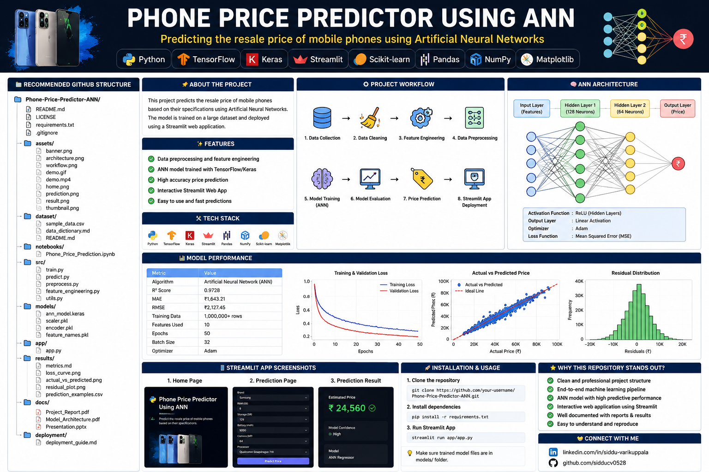
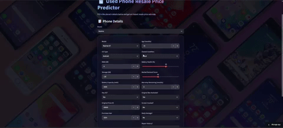
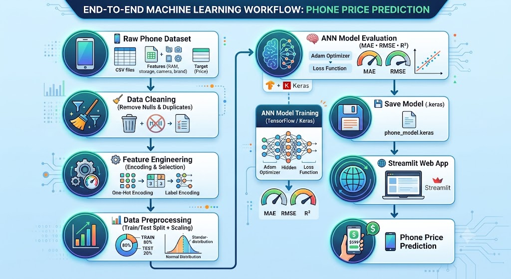
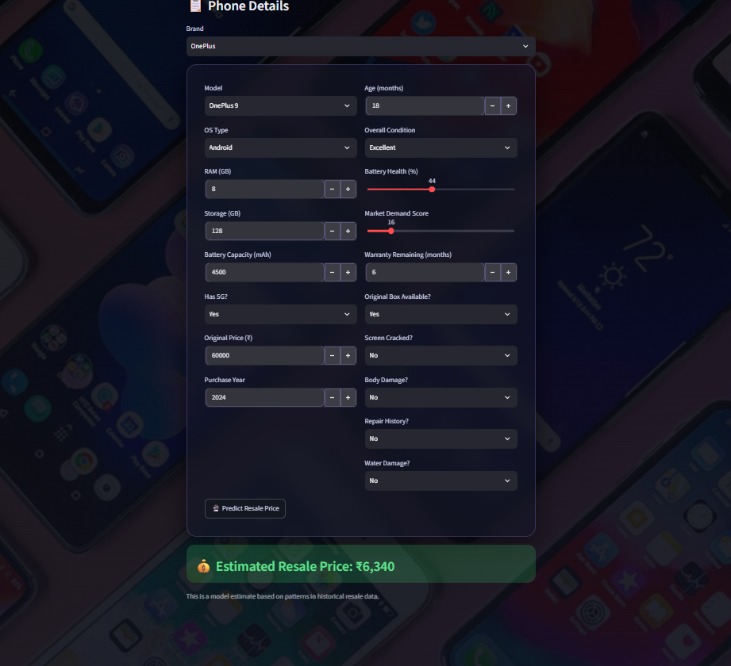

<div align="center">



# 📱 Used Phone Resale Price Predictor

**An Artificial Neural Network that predicts the resale value of a used smartphone from its specs, condition, and market demand — deployed as a live Streamlit app.**

[](https://www.python.org/)
[](https://www.tensorflow.org/)
[](https://phone-price-predictor-siddu.streamlit.app/)
[](LICENSE)

**[🌐 Live Demo](https://phone-price-predictor-siddu.streamlit.app/)** &nbsp;•&nbsp;
**[🎥 Video Walkthrough](https://youtu.be/CWqIut7CfO0)** &nbsp;•&nbsp;
**[📓 Training Notebook](notebooks/phone_price_predictor_ANN_training.ipynb)** &nbsp;•&nbsp;
**[📖 Data Dictionary](dataset/data_dictionary.md)**

</div>

---

## 🎬 Demo

<div align="center">

</div>

Watch the full walkthrough here: **[youtu.be/CWqIut7CfO0](https://youtu.be/CWqIut7CfO0)**

---

## 🎯 Project Overview

| | |
|---|---|
| **Problem type** | Regression — predicting a continuous price value |
| **Model** | Feed-forward ANN (Dense → BatchNorm → Dropout, 3 hidden layers) |
| **Framework** | TensorFlow / Keras |
| **Dataset** | ~1,000,000 used-phone listings (28 features: specs, age, condition, damage history, market demand) |
| **Final performance** | **R² ≈ 0.98** · **MAE ≈ ₹1,600–1,700** |
| **Deployment** | Streamlit Community Cloud |

---

## 🗂️ Project Structure

```
phone-price-predictor/
├── README.md
├── LICENSE
├── requirements.txt
├── train_model.py                 # trains the ANN and saves it to models/
│
├── app/
│   └── app.py                     # Streamlit app (alternate/lightweight version)
├── app.py                         # Streamlit app (root — full version, matches live demo)
│
├── models/                        # trained model + preprocessors
│   ├── phone_price_ann_model.keras
│   ├── x_scaler.pkl
│   ├── y_scaler.pkl
│   ├── feature_names.pkl
│   └── README.md
│
├── dataset/
│   ├── Sample_Data(Phone-prediction).csv   # representative sample (full 1M-row set not included)
│   ├── data_dictionary.md                  # every feature explained, with types & examples
│   └── dataset_info.md                     # dataset summary + preprocessing steps
│
├── notebooks/
│   └── phone_price_predictor_ANN_training.ipynb   # full training pipeline, Colab-ready
│
├── deployment/
│   └── streamlit_deployment.md    # deployment notes + live link
│
└── assets/
    ├── Banner.png
    ├── Demo.gif
    ├── Workflow.jpg
    ├── Phone_price_prediction(ANN).png
    └── Phone_price_prediction(ANN)-output.png
```

> **Note:** `app.py` and `app/app.py` currently differ slightly (the root version adds a background image and a couple of extra style tweaks). Only one is actually used by the deployed app — see [`deployment/streamlit_deployment.md`](deployment/streamlit_deployment.md) for which one, or check your Streamlit Cloud settings.

---

## 🧠 How It Works

<div align="center">

</div>

1. **Data cleaning** — removed duplicates, checked for missing values.
2. **Feature selection** — dropped 8 low-signal columns (`screen_size_inches`, `usage_hours_per_day`, `city_tier`, `seller_type`, `charger_available`, `release_year`, `processor_score`, `camera_score`) based on correlation and feature-importance analysis. Kept the strongest predictors: `original_price`, `age_months`, `market_demand_score`, `battery_health`, `condition`, and others.
3. **Encoding** — categorical columns (`brand`, `model`, `condition`, `os_type`) one-hot encoded.
4. **Scaling** — both features and target scaled with `StandardScaler` for stable ANN training.
5. **Model** — a 3-hidden-layer ANN (`128 → 64 → 32 → 1`) with BatchNormalization and Dropout for regularization.
6. **Training** — Adam optimizer, MSE loss, with `EarlyStopping` and `ReduceLROnPlateau` callbacks.
7. **Evaluation** — MAE, RMSE, and R² computed on a held-out test set.
8. **Deployment** — the trained model + scalers are loaded into a Streamlit app that takes phone details through a form and returns a live price prediction.

Full details for every step are in the [training notebook](notebooks/phone_price_predictor_ANN_training.ipynb).

---

## 📊 Dataset

The dataset contains **28 columns** (27 input features + `resale_price` as the target), covering hardware specs, physical condition, damage/repair history, and market demand.

| Category | Features |
|---|---|
| **Identity & specs** | `brand`, `model`, `release_year`, `ram_gb`, `storage_gb`, `screen_size_inches`, `battery_capacity`, `processor_score`, `camera_score`, `os_type`, `has_5g` |
| **Purchase & age** | `original_price`, `purchase_year`, `age_months`, `usage_hours_per_day` |
| **Condition** | `condition`, `battery_health`, `screen_cracked`, `body_damage`, `repair_history`, `water_damage` |
| **Sale context** | `city_tier`, `seller_type`, `warranty_remaining_months`, `box_available`, `charger_available`, `market_demand_score` |
| **Target** | `resale_price` (₹) |

Only a representative sample (`dataset/Sample_Data(Phone-prediction).csv`) is included in this repo to keep it lightweight — the full ~1M-row dataset used for training is not checked in.

📖 See [`dataset/data_dictionary.md`](dataset/data_dictionary.md) for full type/description/example detail on every column, and [`dataset/dataset_info.md`](dataset/dataset_info.md) for the dataset-level summary.

---

## 📈 Results

<div align="center">

</div>

| Metric | Value | What it means |
|---|---|---|
| **R²** | 0.98 | The model explains ~98% of the variance in resale price |
| **MAE** | ~₹1,600–1,700 | On average, predictions are off by this much in either direction |

---

## 🛠️ Tech Stack

- **Language:** Python
- **Data:** Pandas, NumPy
- **ML:** scikit-learn (preprocessing, metrics), TensorFlow / Keras (ANN)
- **App:** Streamlit
- **Environment:** Google Colab (training) + Streamlit Community Cloud (deployment)

---

## 🚀 Running Locally

**1. Clone the repo**
```bash
git clone https://github.com/sidducv0528/phone-price-predictor.git
cd phone-price-predictor
```

**2. Install dependencies**
```bash
pip install -r requirements.txt
```

**3. (Optional) Retrain the model**
Only needed if you want to retrain from scratch. Place the full `used_phone_price_prediction_1M.csv` in the project root, then:
```bash
python train_model.py
```
This regenerates the 4 files in `models/`. If you just want to run the demo, skip this — the trained model is already included.

**4. Run the app**
```bash
streamlit run app.py
```
Open the link shown in your terminal (usually `http://localhost:8501`).

---

## 🌐 Live Deployment

| | |
|---|---|
| **Live app** | [phone-price-predictor-siddu.streamlit.app](https://phone-price-predictor-siddu.streamlit.app/) |
| **Platform** | Streamlit Community Cloud |
| **Video walkthrough** | [youtu.be/CWqIut7CfO0](https://youtu.be/CWqIut7CfO0) |

See [`deployment/streamlit_deployment.md`](deployment/streamlit_deployment.md) for full deployment notes.

---

## 🔮 Future Improvements

- Consolidate `app.py` and `app/app.py` into a single source of truth
- Add automated tests for the preprocessing/inference pipeline
- Compare ANN performance against a gradient-boosted baseline (XGBoost/LightGBM)
- Add confidence intervals to predictions rather than a single point estimate

---

## 👤 Author

**Siddu Varikuppala**
B.Sc. (Honours) Mathematics, Statistics & Data Science

[](https://linkedin.com/in/siddu-data)
[](https://github.com/sidducv0528)
[](https://kaggle.com/sidduv0528)

---

## 📄 License

This project is licensed under the [MIT License](LICENSE).
